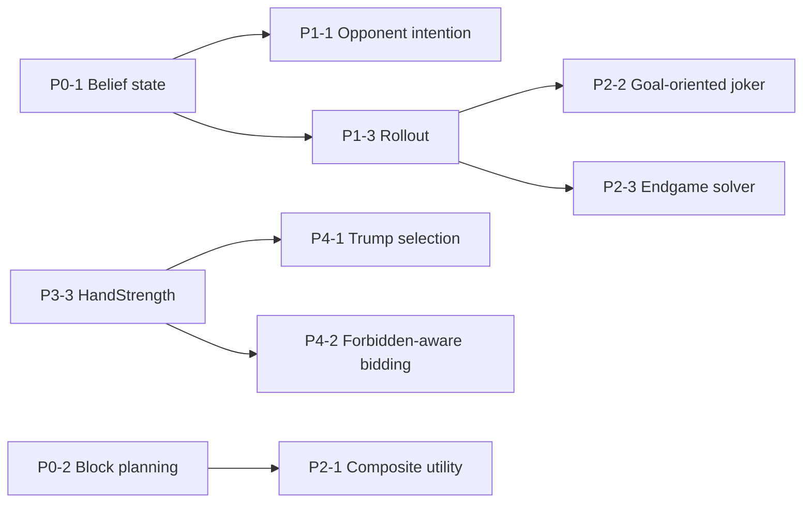

# Предложения по улучшению AI ботов (Unified)

**Дата:** 2026-03-05  
**Статус:** Рабочий backlog (актуализирован под текущую структуру кода)  
**Версия:** 3.3

Документ синхронизирован с актуальными источниками в репозитории:
- `BOT_AI_IMPROVEMENT_PLAN.md` (stage-статусы и принятые guardrails),
- `FOLDER_STRUCTURE_SPEC.md` (границы модулей/таргетов и размещение файлов),
- текущие runtime/self-play реализации в `Jocker/Jocker/Game/Services/AI/` и harness-скрипты в `scripts/`.

Цель: иметь один “мастер”-бэклог инициатив с:
- явной моделью текущих проблем (runtime gaps),
- понятной приоритизацией и зависимостями,
- измеримостью (метрики с определениями),
- минимальными gate-тестами для безопасной итерации.

---

## Актуальная структура AI-слоя (must-follow)

### 1) Runtime (target `Jocker`)

- Runtime-решение хода: `BotTurnStrategyService`, `BotTurnCandidateEvaluatorService`, `BotTurnCandidateRankingService`, `BotTurnCardHeuristicsService`, `BotTurnRoundProjectionService`.
- Runtime-контекст матча: `BotMatchContext`, `BotOpponentModel`, `BotMatchContextBuilder`.
- Runtime bidding/trump: `BotBiddingService`, `BotTrumpSelectionService`, `HandFeatureExtractor`, `BotRankNormalization`.

### 2) Offline/self-play (target `JockerSelfPlayTools`)

- Эволюция и метрики self-play вынесены из app runtime в отдельный таргет:
  - `BotSelfPlayEvolutionEngine.swift`,
  - `BotSelfPlayEvolutionEngine+PublicTypes.swift`,
  - `BotSelfPlayEvolutionEngine+Evolution.swift`,
  - `BotSelfPlayEvolutionEngine+Fitness.swift`,
  - `BotSelfPlayEvolutionEngine+Genome.swift`,
  - `BotSelfPlayEvolutionEngine+Simulation.swift`,
  - `BotTuning+SelfPlayEvolution.swift`.
- Runtime-target `Jocker` не должен получать прямых зависимостей на self-play engine.

### 3) Тестовые и автоматизационные границы

- Self-play unit-тесты используют условный импорт отдельного таргета:
  - `Jocker/JockerTests/Bot/BotSelfPlayEvolutionEngineTests.swift` (`#if canImport(JockerSelfPlayTools)`),
  - часть тестов в `Jocker/JockerTests/Bot/BotTuningTests.swift`.
- Обязательные automation-гейты в репозитории:
  - `make joker-pack`,
  - `make stage6b-pack-all`,
  - `make bot-baseline`,
  - `make bot-compare`.

---

## Словарь (метрики и как их понимать)

Опорное правило: метрики должны быть измеримы через self-play harness и сравнимы между запусками при фиксированных seed и профилях (`make bot-baseline` / `make bot-compare`).

### Матчевые метрики (ядро качества)

- `winRate`: среднее `winShare` по симуляциям; в одной игре `winShare = 1 / winnersCount`, если бот набрал максимальный total score (иначе `0`).
- `averageScoreDiff`: среднее `(botTotalScore - opponentsAverageTotalScore)` по симуляциям.
- `averageUnderbidLoss`: средний штраф за систематический недозаказ (self-play penalty).
- `averagePremiumAssistLoss`: средний штраф за “подаренные премии”, когда бот сам премию не взял, а другие взяли (структурный + пропорциональный gain).
- `averagePremiumPenaltyTargetLoss`: средняя сумма штрафов, назначенных боту как penalty target за премию соперника (по правилам премий).

### Операционные метрики (поведенческие “датчики”)

- `premiumCaptureRate`: доля блоков, где игрок взял премию (regular/zero).
- `penaltyTargetRate`: доля блоков, где игрок стал penalty target.
- `blindSuccessRate`: `successfulBlindRounds / totalBlindRounds`, где успех = `bidMatched` в blind-раундах.
- `jokerWishWinRate`: `wishWins / totalWishLeads` (если `totalWishLeads = 0`, harness репортит `0`).
- `earlyJokerSpendRate`: доля розыгрышей джокера “не в последней взятке” среди всех сыгранных джокеров.
- `bidAccuracyRate`: доля раундов с `bidMatched`.
- `overbidRate`: доля раундов, где `tricksTaken > bid`.
- `blindBidRateBlock4`: доля раздач 4-го блока, где выбран blind.
- `averageBlindBidSize`: средний размер blind-ставки среди blind-раундов.
- `blindBidWhenBehindRate`: доля случаев выбора blind, когда игрок “позади” по матчевому сигналу (по логике harness).
- `blindBidWhenLeadingRate`: доля случаев выбора blind, когда игрок “впереди” по матчевому сигналу (по логике harness).
- `earlyLeadWishJokerRate`: частота “lead face-up joker + wish” не в последней взятке.
- `leftNeighborPremiumAssistRate`: доля премий соседа слева, в которых игрок был “ассистентом” (по определению harness).

Примечание: для всех rate-метрик “0” может означать “не было попыток” (деление на 0 в harness обычно даёт 0). Для постановки целей полезно фиксировать рядом счётчики событий (attempt counts).

### Дополнительные/будущие метрики (потребуют инструментирования)

- `endgameAccuracy` (предложение): `bidAccuracyRate` на подмножестве раундов с `cardsInRound <= 3`. Сейчас в harness считаются только агрегаты по всем раундам; для этой метрики нужен раздельный учёт по диапазонам `cardsInRound`.

---

## Runtime gaps taxonomy (RG-1 … RG-8)

Таксономия “дыр” текущего runtime-алгоритма. Каждая инициатива в backlog должна явно закрывать один или несколько gaps.

- `RG-1` Legal-aware win probability: оценка “удержим ли взятку” недостаточно учитывает легальность ответов соперников (обязаловка масти/козыря).
- `RG-2` Belief state: нет формализованного состояния скрытой информации (void suits, вероятности распределений); есть только “unseen cards” и агрегаты.
- `RG-3` Goals/intent: нет явного учёта целей других игроков (их заказы/дефициты/стратегия) в utility, кроме частичных premium/penalty сигналов.
- `RG-4` Lookahead: решения в основном myopic; нет rollout/endgame решателя для top-N кандидатов.
- `RG-5` Consistency: bidding/projection/turn не разделяют единую модель силы руки и ожиданий.
- `RG-6` Utility composition: утилита преимущественно аддитивна; взаимодействия факторов (risk/urgency/joker) выражены неявно и плохо контролируются.
- `RG-7` Blind EV: выбор blind по сути без оценки распределения/EV (нет симуляции/интеграла по “скрытым” рукам).
- `RG-8` Threat context: threat учитывает фазу, но слабо учитывает позицию в взятке и “что уже вышло” (контекст сыгранных карт).

---

## Backlog инициатив (13 шт., с текущим статусом)

| ID | Инициатива | Приоритет | Runtime gaps | Слой | Статус в коде | Оценка |
|---|------------|-----------|--------------|------|---------------|--------|
| P0-1 | Belief state + legal-aware win probability | P0 | `RG-1`, `RG-2` | Runtime | выполнено (runtime + unit/regression гейты) | 12-16 ч |
| P0-2 | Block-level planning | P0 | `RG-3`, `RG-6` | Runtime | выполнено (BlockPlan v1 + guardrails) | 4-6 ч |
| P1-1 | Opponent intention modeling | P1 | `RG-1`, `RG-2`, `RG-3` | Runtime | выполнено (compact intention model v1 + no-evidence neutrality) | 12-16 ч |
| P1-2 | Opponent bid/deficit pressure in utility | P1 | `RG-3`, `RG-6` | Runtime + Flow plumbing | выполнено (round-state plumbing + deny-exact utility shift) | 6-10 ч |
| P1-3 | Rollout для top-N кандидатов | P1 | `RG-4`, `RG-2` | Runtime | выполнено (deterministic top-N rollout, strict budget, conditional apply) | 12-16 ч |
| P2-1 | Composite utility model | P2 | `RG-6` | Runtime | частично (декомпозиция есть, композиция аддитивна) | 8-12 ч |
| P2-2 | Goal-oriented joker declaration | P2 | `RG-4`, `RG-6` | Runtime | частично (эвристики + strict regression) | 16-20 ч |
| P2-3 | Эндгейм-решатель | P2 | `RG-4` | Runtime | не начато | 8-12 ч |
| P3-1 | Monte-Carlo blind evaluation | P3 | `RG-7`, `RG-2` | Runtime + Self-play | не начато | 6-8 ч |
| P3-2 | Context-aware card threat | P3 | `RG-8` | Runtime | частично (phase-aware, без position/history context) | 4-6 ч |
| P3-3 | Единый HandStrength model (bidding+projection) | P3 | `RG-5` | Runtime | частично (общий extractor есть, формулы разные) | 6-8 ч |
| P4-1 | Multi-factor trump selection | P4 | `RG-5` | Runtime | частично (базовые multi-factor уже есть) | 3-4 ч |
| P4-2 | Forbidden-aware bidding | P4 | `RG-5` | Runtime | частично (skip forbidden + tie-break, без utility cost) | 2-3 ч |

---

## Mapping инициатив к текущим файлам

- Runtime decision stack (основная точка изменений для `P0-1`, `P0-2`, `P1-1`, `P1-2`, `P1-3`, `P2-1`, `P2-2`, `P2-3`, `P3-2`):
  - `Jocker/Jocker/Game/Services/AI/BotTurnCardHeuristicsService.swift`
  - `Jocker/Jocker/Game/Services/AI/BotTurnCandidateEvaluatorService.swift`
  - `Jocker/Jocker/Game/Services/AI/BotTurnCandidateRankingService.swift`
  - `Jocker/Jocker/Game/Services/AI/BotTurnRoundProjectionService.swift`
  - `Jocker/Jocker/Game/Services/AI/BotTurnStrategyService.swift`
- Match/opponent context plumbing (база для `P0-2`, `P1-1`, `P1-2`):
  - `Jocker/Jocker/Models/Bot/BotMatchContext.swift`
  - `Jocker/Jocker/Models/Bot/BotOpponentModel.swift`
  - `Jocker/Jocker/Game/Services/AI/BotMatchContextBuilder.swift`
  - `Jocker/Jocker/Game/Services/Flow/GameTurnService.swift`
  - `Jocker/Jocker/Game/Scenes/GameScene+PlayingFlow.swift`
- Bidding/trump/hand-consistency (`P3-1`, `P3-3`, `P4-1`, `P4-2`):
  - `Jocker/Jocker/Game/Services/AI/BotBiddingService.swift`
  - `Jocker/Jocker/Game/Services/AI/BotTrumpSelectionService.swift`
  - `Jocker/Jocker/Game/Services/AI/HandFeatureExtractor.swift`
  - `Jocker/Jocker/Game/Services/AI/BotRankNormalization.swift`
- Self-play/harness слой (`P3-1` и проверка всех инициатив по метрикам):
  - `Jocker/Jocker/Game/Services/AI/BotSelfPlayEvolutionEngine+PublicTypes.swift`
  - `Jocker/Jocker/Game/Services/AI/BotSelfPlayEvolutionEngine+Fitness.swift`
  - `Jocker/Jocker/Game/Services/AI/BotSelfPlayEvolutionEngine+Simulation.swift`
  - `Jocker/Jocker/Game/Services/AI/BotSelfPlayEvolutionEngine+Evolution.swift`
  - `scripts/train_bot_tuning.sh`
  - `scripts/run_bot_baseline_snapshot.sh`
  - `scripts/run_bot_ab_comparison_snapshot.sh`

## Детализация инициатив

### P0-1. Belief state + legal-aware win probability

**Runtime gaps:** `RG-1`, `RG-2`

Проблема: `estimateImmediateWinProbability` сейчас предполагает, что соперник может ответить любой unseen-картой (и “перебить”), что системно смещает вероятность и ломает utility в ключевых местах.

MVP-решение:
- ввести “легковесный” belief state, минимум: `voidSuits` (если игрок не поддержал масть — вероятно void);
- заменить “beaterRatio по всем unseen” на оценку по *легальным* ответам соперников (Monte Carlo 20–50 семплов распределений unseen по игрокам);
- оставить fallback на legacy-оценку (если belief state недоступен или budget ограничен).

Integration touchpoints:
- `Jocker/Jocker/Game/Services/AI/BotTurnCardHeuristicsService.swift` (вероятность/оценка перебития),
- `Jocker/Jocker/Game/Services/AI/BotTurnCandidateEvaluatorService.swift` (передача контекста игроков/семплинг budget),
- (опционально) новый pure helper `BotBeliefState` в `Jocker/Jocker/Game/Services/AI/` без зависимости на self-play target.

Минимальные тесты/гейты:
- Unit: infer void suit по сценарию “не ответил в масть”,
- Unit: legal-aware probability monotonicity (если у всех соперников void leadSuit, вероятность удержания должна расти),
- Regression: joker-pack + stage6b-pack-all + compare-v1.

Риски:
- производительность (семплинг): mitigation через conditional-apply (только endgame/joker/high-urgency) и ограничение итераций.

---

### P0-2. Block-level planning

**Runtime gaps:** `RG-3`, `RG-6`

Проблема: без плана на блок бот принимает решения myopic и “выигрывает взятку ради взятки”, не оптимизируя траекторию премий/штрафов и риск в конце блока.

MVP-решение:
- построить `BlockPlan` на основе `BotMatchContext` (remainingRounds, premium-candidate flags, match risk);
- влиять на utility через понятные коэффициенты/мультипликаторы (risk budget, urgency).

Integration touchpoints:
- `Jocker/Jocker/Game/Services/AI/BotTurnCandidateRankingService.swift` (utility adjustment),
- `Jocker/Jocker/Models/Bot/BotMatchContext.swift` + `Jocker/Jocker/Game/Services/AI/BotMatchContextBuilder.swift`.

Минимальные тесты/гейты:
- Unit: plan creation invariants (remainingRounds, urgency weights),
- Regression: premium/penalty guardrails packs + compare-v1.

---

### P1-1. Opponent intention modeling

**Runtime gaps:** `RG-1`, `RG-2`, `RG-3`

Проблема: текущая модель соперников в основном “rates-only”; нет предсказания намерения в конкретной взятке/раунде, из-за чего бот часто “помогает” чужому exact-bid или премии.

MVP-решение:
- объединить: (1) belief-state сигналы (void/trump likelihood) + (2) bid-state соперника (needs/over/under) + (3) текущая взятка (позиция/lead suit);
- выдавать компактный `OpponentIntentionModel`, используемый в utility как adjustment (не заменять всю систему).

Integration touchpoints:
- `Jocker/Jocker/Models/Bot/BotOpponentModel.swift` (как источник “rates”),
- `Jocker/Jocker/Models/Bot/BotMatchContext.swift` + `Jocker/Jocker/Game/Services/AI/BotMatchContextBuilder.swift` (расширение round-state),
- `Jocker/Jocker/Game/Services/AI/BotTurnCandidateRankingService.swift` (utility adjustment).

Минимальные тесты/гейты:
- Unit: no-evidence neutrality (при отсутствии evidence adjustment должен быть ~0),
- Regression: stage6b-pack-all (style-shift, neutrality) + compare-v1.

---

### P1-2. Opponent bid/deficit pressure in utility

**Runtime gaps:** `RG-3`, `RG-6`

Проблема: даже без full “intention modeling” боту полезно понимать, кто из соперников близок к exact-bid и как это влияет на ценность конкретной взятки/хода.

MVP-решение:
- протянуть в decision-context минимальный round-state: `bids[]`, `tricksTaken[]` для всех игроков;
- добавить utility adjustment “deny exact”:
  - повышать ценность взятки/контроля, если следующий/левый сосед “needsTricks == 1”;
  - в dump-режиме избегать “безопасных” ходов, которые отдают взятку игроку, который ровно добирает.

Integration touchpoints:
- Flow plumbing: `GameState`/`GameTurnService`/`GameScene+PlayingFlow` -> `BotTurnStrategyService.BotTurnDecisionContext`,
- `Jocker/Jocker/Game/Services/AI/BotTurnCandidateRankingService.swift`.

Минимальные тесты/гейты:
- Unit: сценарий “opponent needs 1 trick” (utility shift в нужную сторону),
- Regression: compare-v1 + существующие premium/penalty packs.

---

### P1-3. Rollout для top-N кандидатов

**Runtime gaps:** `RG-4`, `RG-2`

Проблема: в джокере/эндгейме локальные эвристики часто ошибаются; нужен limited lookahead, но только там, где это окупается.

MVP-решение:
- после базового скоринга взять top 2–3 кандидата и досимулировать 1–2 взятки вперёд;
- семплинг скрытых рук оппонентов делать из belief-state (если есть) или через simple unseen split.

Условия применения:
- `handSize <= 4`,
- или ход с джокером,
- или high-urgency (конец блока / критический дефицит взяток).

Риски:
- perf + детерминизм; mitigation через фиксированный seed/PRNG и жёсткий лимит итераций.

---

### P2-1. Composite utility model

**Runtime gaps:** `RG-6`

Проблема: аддитивная утилита плохо отражает взаимодействия факторов (risk/urgency/joker), сложно контролировать масштаб и избежать “побочных побед”.

MVP-решение:
- ввести структуру, где есть:
  - базовая ценность (score / chase-dump),
  - риск-мультипликатор (premium/penalty),
  - urgency-bias,
  - joker-modifier,
  - и строгие ограничения диапазонов, чтобы не раздувать utility.

Не цель (на MVP): переписать все текущие компоненты utility; достаточно “обёртки” для более контролируемой композиции.

---

### P2-2. Goal-oriented joker declaration

**Runtime gaps:** `RG-4`, `RG-6`

Проблема: выбор `wish/above/takes` сейчас в основном “эвристика коэффициентов”, а не оптимизация цели (контроль/denial/controlled loss).

MVP-решение:
- для lead-joker деклараций явным образом оценивать 2–3 цели:
  - `secureTrick` (забрать/удержать),
  - `preserveControl` (удержать управление под будущие взятки),
  - `controlledLoss` (безопасно отдать при dump/penalty-risk),
- подкрепить спорные случаи rollout-оценкой (P1-3).

---

### P2-3. Эндгейм-решатель

**Runtime gaps:** `RG-4`

Проблема: при 1–3 картах на руке можно почти точно оценить последствия; текущая эвристика даёт непропорционально много ошибок именно в конце.

MVP-решение:
- включать решатель только при `handSize <= 3`;
- семплировать скрытые карты оппонентов (если нужно) и выбирать ход по среднему исходу;
- ограничить глубину (до конца раунда) и budget.

---

### P3-1. Monte-Carlo blind evaluation

**Runtime gaps:** `RG-7`, `RG-2`

Проблема: blind-ставка выбирается без оценки распределения/EV; нужен вероятностный слой хотя бы для “стоит ли рисковать” и “какой размер”.

MVP-решение:
- Monte Carlo на прераздаче: оценить распределение `expectedTricks` и выбрать blind bid по ожидаемой полезности (score/variance/risk budget).

---

### P3-2. Context-aware card threat

**Runtime gaps:** `RG-8`

Проблема: threat уже учитывает фазу, но почти не учитывает позицию в взятке и контекст сыгранных карт (сколько старших уже вышло, насколько карта всё ещё “ресурс”).

MVP-решение:
- модификатор threat по позиции (lead/second/third/last),
- модификатор по “вышли ли старшие” (простая оценка на основе сыгранных карт в взятке/раунде),
- не ломать базовую шкалу threat; использовать небольшие коэффициенты.

---

### P3-3. Единый HandStrength model (bidding + projection)

**Runtime gaps:** `RG-5`

Проблема: `BotBiddingService` и `BotTurnRoundProjectionService` используют разные формулы; это создаёт несогласованное поведение “заказал одно — играет в другое”.

MVP-решение:
- вынести оценку силы руки в один pure-модуль,
- использовать его и в bidding, и в projection (возможно, с разными “режимами”).

---

### P4-1. Multi-factor trump selection

**Runtime gaps:** `RG-5`

Проблема: выбор козыря основан на упрощённой оценке; можно улучшить консистентность с hand-strength моделью.

MVP-решение:
- добавить факторы “длина/плотность масти”, “последовательность рангов”, “джокер-синергия”,
- но не усложнять раньше, чем появится единый HandStrength.

---

### P4-2. Forbidden-aware bidding

**Runtime gaps:** `RG-5`

Проблема: при `forbiddenBid` бот просто пропускает значение, не оценивая стоимость отклонения от оптимума.

MVP-решение:
- оценивать “цена отклонения” и выбирать ближайший по utility bid, а не только по projected score.

---

## Зависимости (высокий уровень)

---

## Дорожная карта (ориентир)

Фаза 1 (P0, “фундамент”):
- P0-1 Belief + legal-aware probability
- P0-2 Block planning
- Gates: `build-for-testing` (scheme `Jocker`) + build scheme `JockerSelfPlayTools` + `make joker-pack` + `make stage6b-pack-all` + `make bot-compare`
- Self-play checkpoint: `SP-1` (smoke retune, `turnStrategy-only`, без promotion).

### Статус Phase 1 (2026-03-05)

- `P0-1` закрыт: введён `BotBeliefState`, легальность ответов соперников учитывается в `estimateImmediateWinProbability` через legal-aware симуляцию с budget-гейтингом.
- `P0-2` закрыт: внедрён `BlockPlan` и обновлён `matchCatchUpUtilityAdjustment` с `riskBudget/urgency`.
- Regression gates (финальный проход для formal close):
  - `build-for-testing` (`Jocker`): pass.
  - build scheme `JockerSelfPlayTools`: pass.
  - `joker-pack` (strict): `16/16`, артефакты `.derivedData/joker-regression-runs/20260305-014146`.
  - `stage6b-pack-all`: `18/18`, артефакты `.derivedData/stage6b-ranking-runs/20260305-014330`.
  - `test-without-building` `BotSelfPlayEvolutionEngineTests`: pass (`iPhone 15`, id `4F592A52-148C-4540-BB72-590B8C44BD43`).
  - `compare-v1` gate (`make bot-compare`): pass, артефакты `.derivedData/bot-ab-runs/20260305-014405`.
- Self-play checkpoint `SP-1`:
  - выполнен smoke retune (`turnStrategy-only`) по протоколу;
  - артефакты `.derivedData/bot-ab-runs/20260305-012801`;
  - `primary/holdout` по quality-core: `Badv = 0.000000` (нейтральный результат, без promotion).
- Результат `compare-v1` (holdout, quality-core): `fitness_Badv=+0.865661`, `winRate_Badv=+0.010417`, `scoreDiff_Badv=+388.871528`.
- `Phase 1` формально закрыта.

Фаза 2 (P1, “opponent awareness + lookahead”):
- P1-2 Opponent bid/deficit pressure (как быстрый win для RG-3)
- P1-1 Opponent intention (если P0-1 уже даёт belief state)
- P1-3 Rollout top-N (условно/точечно)
- Self-play checkpoint: `SP-2` (`compare-v1`, `turnStrategy-only`, решение о promotion по holdout).

### Статус Phase 2 (2026-03-05)

- `P1-2` закрыт:
  - расширен runtime `round-state` (`bids[]`, `tricksTaken[]`, `isBlindBid[]`) от `GameScene+PlayingFlow` / `GameTurnService` / `GameSceneCoordinator` до `BotTurnStrategyService` и evaluator/ranking;
  - добавлен utility-shift `deny exact` для сценариев `needsTricks == 1` (chase/dump).
- `P1-1` закрыт:
  - введён `OpponentIntentionModel` в turn-stack (signals: bid deficit, trick position, belief void-suit hints, observed rates/style);
  - соблюдён strict `no-evidence neutrality` (unit/stage6b guardrails).
- `P1-3` закрыт:
  - реализован deterministic rollout для top-N кандидатов (`horizon <= 2`);
  - после perf-коррекции применён строгий budget: `topCandidateCount=2`, `iterations=4...8`, `maxCardsPerOpponentSample=2`, conditional-apply только в высокоценных сценариях.
- Regression gates (final pass):
  - `build-for-testing` (`Jocker`): pass;
  - build scheme `JockerSelfPlayTools`: pass;
  - `joker-pack` (strict): `16/16`, артефакты `.derivedData/joker-regression-runs/20260305-105533`;
  - `stage6b-pack-all`: `18/18`, артефакты `.derivedData/stage6b-ranking-runs/20260305-105559`;
  - `test-without-building` `BotSelfPlayEvolutionEngineTests`: pass (`iPhone 15`, id `4F592A52-148C-4540-BB72-590B8C44BD43`).
- Self-play checkpoint `SP-2` (`compare-v1`, `turnStrategy-only`):
  - артефакты `.derivedData/bot-ab-runs/20260305-105643`;
  - `holdout` quality-core: `fitness_Badv=-0.286803`, `winRate_Badv=-0.070312`, `scoreDiff_Badv=-96.423611`;
  - решение: `C reject/rollback` (tuned snapshot не продвигать, baseline остаётся promoted).
- Итог: `Phase 2` формально закрыта по реализации и gate-тестам; promotion по `SP-2` отклонён.

Фаза 3 (P2, “ядро решения”):
- P2-2 Goal-oriented joker (в связке с rollout)
- P2-3 Endgame solver
- P2-1 Composite utility (если стало сложно контролировать взаимодействия)
- Self-play checkpoint: повтор `SP-2` после закрытия P2-пакета.

Фаза 4 (P3–P4, “consistency + полировка”):
- P3-3 HandStrength
- P3-1 Monte-Carlo blind
- P3-2 Context-aware threat
- P4-1 Trump
- P4-2 Forbidden-aware bidding
- Self-play checkpoint: `SP-3` (`compare-v1`, `tuning-scope=all`) + финальный `SP-4` (ensemble).

---

## Протокол самообучения (когда запускать и с какими параметрами)

Правило: самообучение запускается только после зелёных runtime-gate тестов. Не запускаем эволюцию после каждого PR.

### SP-0. Baseline refresh (до первой ретюнинг-итерации в ветке)

Когда:
- перед началом новой серии AI-изменений, если baseline в ветке устарел;
- после изменения telemetry/fitness-метрик в self-play harness.

Команда:
- `make bot-baseline`

Параметры:
- профиль `baseline-v1` (из `scripts/run_bot_baseline_snapshot.sh`): seed-list `20260220...20260225`, `gamesPerCandidate=8`, `roundsPerGame=24`, `generations=0`.

### SP-1. Smoke retune checkpoint (после закрытия Phase 1)

Когда:
- после завершения пакета `P0-1` + `P0-2`;
- цель: быстро проверить направление эффекта, не продвигать коэффициенты в runtime.

Команда:
- `./scripts/run_bot_ab_comparison_snapshot.sh --profile smoke -- --tuning-scope turnStrategy-only --early-stop-patience 2 --early-stop-min-improvement 0.010 --early-stop-warmup-generations 1`

Параметры:
- `profile=smoke` (`population=4`, `generations=2`, `gamesPerCandidate=2`, `rounds=12`);
- `tuning-scope=turnStrategy-only` для минимизации риска регрессий вне turn-stack.

### SP-2. Promotion checkpoint для turn-stack (после Phase 2 и после Phase 3)

Когда:
- после закрытия `P1` пакета;
- повторно после закрытия `P2` пакета;
- использовать для решения, можно ли продвигать tuned snapshot.

Команда:
- `./scripts/run_bot_ab_comparison_snapshot.sh --profile compare-v1 -- --tuning-scope turnStrategy-only --early-stop-patience 4 --early-stop-min-improvement 0.010 --early-stop-warmup-generations 4`

Параметры:
- `profile=compare-v1` (seed-list `20260220...20260225`, holdout `20260226...20260303`, `population=10`, `generations=10`, `gamesPerCandidate=8`, `rounds=24`);
- `tuning-scope=turnStrategy-only`.

### SP-3. Promotion checkpoint для bidding/trump/hand model (после Phase 4)

Когда:
- после изменений в `P3-1`, `P3-3`, `P4-1`, `P4-2` (затрагивают `bidding`/`trumpSelection`/консистентность hand model).

Команда:
- `./scripts/run_bot_ab_comparison_snapshot.sh --profile compare-v1 -- --tuning-scope all --early-stop-patience 4 --early-stop-min-improvement 0.010 --early-stop-warmup-generations 4`

Параметры:
- те же, что `SP-2`, но `tuning-scope=all`.

### SP-4. Финальный ensemble run (release-candidate)

Когда:
- после завершения всех целевых инициатив, перед финальным freeze tuning-коэффициентов.

Команды:
- `make bt-hard-final-esab`
- `make bot-compare`

Параметры:
- `bt-hard-final-esab` использует multi-seed ensemble (`seed-list 20260220...20260225`, `ensemble=median`) и battle-профиль (`population=30`, `generations=48`, `gamesPerCandidate=40`, `rounds=24`) с early-stop + holdout A/B.

### Решение по итогам самообучения (A/B/C)

- `A: promote`:
  - в `holdout` секции `fitness_Badv > 0`, `winRate_Badv > 0`, `scoreDiff_Badv > 0`;
  - `joker-pack` и `stage6b-pack-all` остаются зелёными после применения tuned snapshot.
- `B: iterate`:
  - mixed результат (часть quality-core метрик положительная, часть около 0/слегка отрицательная);
  - запускаем ещё одну итерацию с той же фазой/гипотезой.
- `C: reject/rollback`:
  - в `holdout` отрицательный quality-core (`fitness_Badv < 0` или одновременно `winRate_Badv < 0` и `scoreDiff_Badv < 0`);
  - tuned snapshot не продвигаем, остаёмся на предыдущем promoted.

---

## Целевые метрики (ориентир на “после всех фаз”)

Baseline ниже приведён как пример (обновлять по актуальному `make bot-baseline`).

| Метрика | Baseline (пример) | Target (после всех фаз) |
|---------|-------------------:|-------------------------:|
| `winRate` | 0.25 | 0.40-0.45 |
| `averageScoreDiff` | 0.00 | +450-550 |
| `averagePremiumAssistLoss` | 26.25 | <15 |
| `averagePremiumPenaltyTargetLoss` | 4.95 | <2.5 |
| `blindSuccessRate` | 0.087 | 0.25-0.30 |
| `jokerWishWinRate` | 0.00 | 0.35-0.45 |
| `bidAccuracyRate` | 0.46 | 0.60-0.65 |

---

## Минимальный набор gate-тестов (policy)

Перед любым “compare”:
- `xcodebuild -quiet -project Jocker/Jocker.xcodeproj -scheme Jocker -destination 'generic/platform=iOS Simulator' -derivedDataPath .derivedData CODE_SIGNING_ALLOWED=NO build-for-testing`,
- `xcodebuild -quiet -project Jocker/Jocker.xcodeproj -scheme JockerSelfPlayTools -sdk iphonesimulator -derivedDataPath .derivedData CODE_SIGNING_ALLOWED=NO build`,
- `make joker-pack` (джокер-регрессии),
- `make stage6b-pack-all` (opponent-aware guardrails + flow plumbing),
- `xcodebuild test-without-building` на `JockerTests/BotSelfPlayEvolutionEngineTests` для concrete simulator destination (например `iPhone 15`, id `4F592A52-148C-4540-BB72-590B8C44BD43`),
- затем `make bot-compare` (профиль `compare-v1` по умолчанию).

---

## Риски и митигация (коротко)

- Производительность (rollout/MC): conditional apply, строгий budget, фиксированные seed.
- Сложность отладки (belief state): поэтапное включение + строгие unit-тесты на обновление состояния.
- Overfit: всегда держать holdout-гейт (compare-v1), продвигать только стабильные улучшения.
